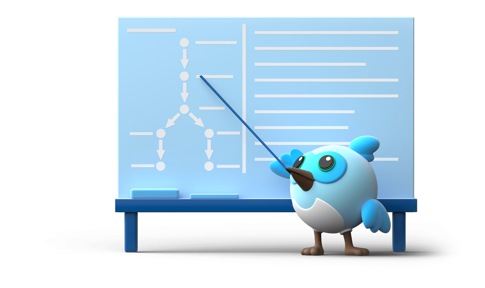

 Decorate GitHub Profile or any Repo like me! 

  
  

### ✨ Talking about Personal Stuffs:

- 저는 Flutter로 앱을 개발하며,   필요에따라 Android(java, kotlin), iOS(swift)를 활용하고 있습니다.
- 앱 품질 향상을 통해 서비스 기여하는데 관심이 있습니다.
- 새로운 기술을 탐구하고, 문제 해결에 활용하는 것을 좋아합니다.
- 팀원과 일적으로/사적으로 소통하는 것을 좋아합니다.
- How To Reach Me : tkdldjs312@naver.com
  
### ⚒️ Stack
<table>
  <tr>
    <td>

  

  

  

  

    

        
    </td>
  <td>
    
    
  </td>
  </tr>
</table>
